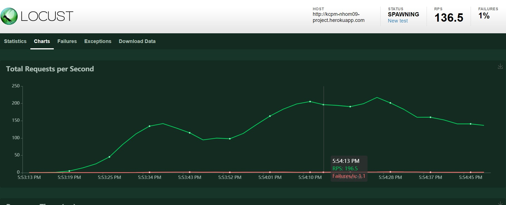
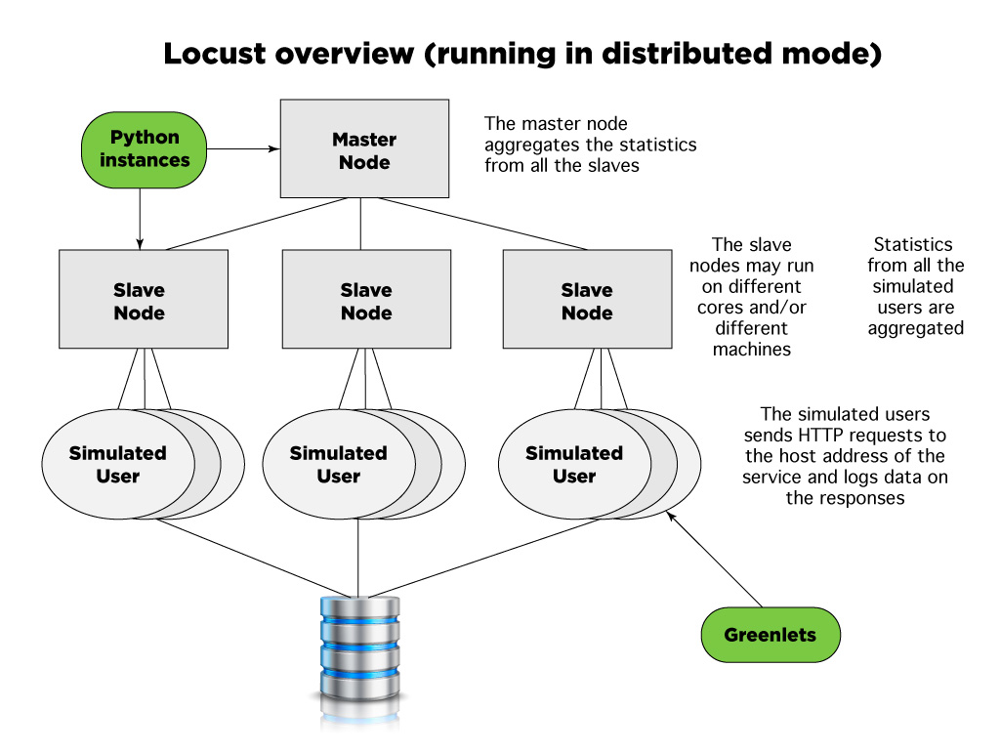
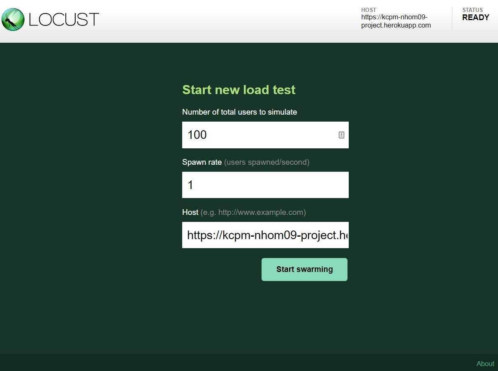
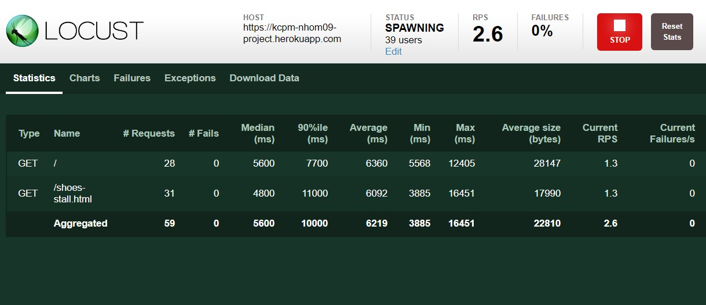
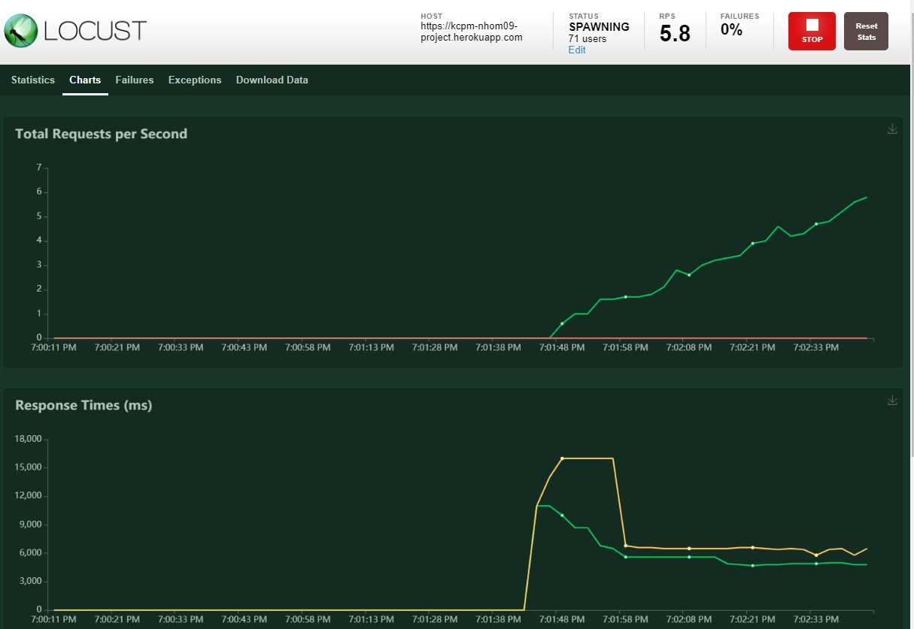

# TÌM HIỂU CÔNG CỤ LOAD TESTING - LOCUST

## 1. Tổng quan

### 1.1 Locust

[locust.io](https://locust.io/) là một công cụ dùng để kiểm thử độ chịu tải của ứng dụng. Được phát triển bằng ngôn ngữ Python và sử dụng bằng cách *viết Python* để xây dựng kịch bản tests.

### 1.2 Locust có những tính năng gì?

* Giao diện web dashboard giúp cho người tester thao tác dễ dàng để thay đổi đầu vào.

* Biểu đồ đường thẳng (line graph) và bảng mô tả trạng thái các requests theo thời gian



* Kịch bản được xây dựng bằng Python scripts. Người Tester sẽ viết Python để thiết kế kịch bản kiểm thử.

* Hỗ trợ phân tán (**distributed**). Nghĩa là ta có thể chạy script ở nhiều máy khác nhau và gửi thông tin test về một máy chủ để thu nhập. Trong trường hợp một máy tính không thể giả lập được quá nhiều requests. (Xem phần [**2** để hiểu rõ thêm](#part2))

## 2. Cách hoạt động của Locust

<a name="part2"></a>


<center>
Source: https://intersog.com/blog/load-testing-via-locust-framework/
</center>

* Locust sẽ giả lập nhiều request (tương ứng một 1 User truy cập đến trang web) với số lượng cho trước và gửi đến trang web.

* Locust có thể tăng dần số request từ 0 đến MAX (MAX là số người tester quy định) theo thời gian chứ không gửi một lần MAX request cùng lúc.

* Request mỗi lần gửi sẽ được tester quy định bằng Python script như: `URL, Data, Querystring, HTTP Headers, ...`

* Locust thu thập trạng thái của mỗi request về và hiển thị lên web dashboard. Tester cũng có thể viết Python script này để gửi các thông tin đó về nơi khác như database.

## 3. Cài đặt Locust

### 3.1 Python

Vì Locust dựa trên Python nên ta cần cài đặt Python (version >= 3.6 là tốt nhất):

- [https://www.python.org/downloads/](https://www.python.org/downloads/)

### 3.2 Cài đặt locust

Sau khi ta cài đặt Python, ta sẽ cài Locust bằng Package Manager của Python ta vừa cài bằng command-line (hoặc bash):

```bash
pip install locust
```

### 3.3 Kiểm tra cài đặt và cách sử dụng

Sau khi cài đặt, ta gõ:

```bash
locust --help
```

Kết quả sẽ show ra cách sử dụng locust:

```
Usage: locust [OPTIONS] [UserClass ...]

Common options:
  -h, --help            show this help message and exit
  -f LOCUSTFILE, --locustfile LOCUSTFILE
                        Python module file to import, e.g. '../other.py'.
                        Default: locustfile
  --config CONFIG       Config file path
  -H HOST, --host HOST  Host to load test in the following format:
                        http://10.21.32.33
  -u NUM_USERS, --users NUM_USERS
                        Number of concurrent Locust users. Primarily used
                        together with --headless. Can be changed during a test
                        by inputs w, W(spawn 1, 10 users) and s, S(stop 1, 10
                        users)
  -r SPAWN_RATE, --spawn-rate SPAWN_RATE
                        The rate per second in which users are spawned.
                        Primarily used together with --headless
  -t RUN_TIME, --run-time RUN_TIME
                        Stop after the specified amount of time, e.g. (300s,
                        20m, 3h, 1h30m, etc.). Only used together with
                        --headless. Defaults to run forever.
  -l, --list            Show list of possible User classes and exit

...
...
```

Xem chi tiết ở [https://docs.locust.io](https://docs.locust.io)

## 4. Sử dụng Locust

Giả sử ta đang ở thư mục `~/project/load-testing/` và ta đang muốn test trang `https://kcpm-nhom09-project.herokuapp.com` và `https://kcpm-nhom09-project.herokuapp.com/shoes-stall.html`

Ta viết file script có tên là `locustfile.py` ở `~/project/load-testing`:

```python
from locust import HttpUser, between, task

class TestProject(HttpUser):
    host = "https://kcpm-nhom09-project.herokuapp.com"
    wait_time = between(5, 10) # in seconds

    @task
    def homepage(self):
        self.client.get("/")

    @task
    def search_page(self):
        self.client.get("/shoes-stall.html")

```

Ở folder đó, ta chạy dòng lệnh:

```bash
locust
```

Và truy cập vào trang http://localhost:8089 bằng trình duyệt



Ta nhập số lượng "User" giả lập và độ tăng dần mỗi giây và chạy





Như ta thấy, Locust thu nhập được cho ta:

1. Request per seconds (RPS): Số request có thể xử lý trong 1 giây.

2. Response time theo miliseconds: thời gian phản hồi khi lượng users đông lên.

3. Các exception catch được từ requests (nếu có).

## 5. Phát triển bài toán

Trong thực tế, ta sẽ không chỉ load testing trang chủ mà ta sẽ load test các trang khác, với những tham số khác nhau.

Locust có hỗ trợ nhiều plugins khác:

- Other Protocol: không những test HTTP mà còn test các cổng khác như gRPC, Socket, ...

- WebDriver: Load Testing bằng trình duyệt

- HTML Resources: Load Testing mà load luôn cả css, js, images bên trong trang web

- ...

Xem thêm: [https://github.com/locustio/locust/wiki/Extensions](https://github.com/locustio/locust/wiki/Extensions)

VD về Bài toán của nhóm:

* Những trang cần test:
    
    * Truy cập trang chủ và trang danh sách hàng

    * Load resources khác như css,js,images, ...

    * Load tất cả các trang chi tiết của mỗi product

    * Load trang trong trạng thái đăng nhập

* Chạy file `main.py` ở folder này

    ```bash
    locust -f main.py
    ```


## 6. Ưu nhược điểm

**1. Ưu điểm:**

- Có thể tùy biến bằng Python code

- Hỗ trợ distributed

- Giao diện dashboard đơn giản, không phức tạp

- Hỗ trợ visualize, export csv và logs.

**2. Nhược điểm:**

- Cần có kiến thức về lập trình Python

- Không có hệ thống Capture và Replay (Quay lại các trạng thái đã test)

- Cần có kiến thức về giao thức HTTP

- Chỉ hỗ trợ load testing
